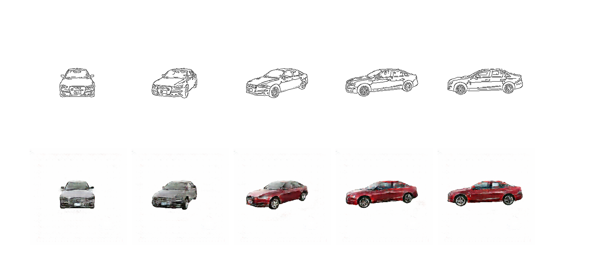
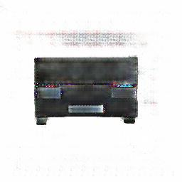
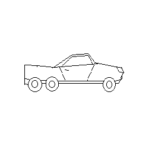

## Реализация статьи о pix2pix

В данной работе представлена реализация алгоритма перевода одних изображений в другие (pix2pix) из статьи [Image-to-Image Translation with Conditional Adversarial Networks](https://arxiv.org/abs/1611.07004) (далее - статья), на примере получения цветной картинки из краев изображения, наброска (edges, sketch). Работоспособность данной реализации протестирована на двух наборах данных: [edges2shoes](https://www.kaggle.com/vikramtiwari/pix2pix-dataset), который использовали авторы статьи, и [набор фотографий автомобилей](https://www.kaggle.com/c/carvana-image-masking-challenge), преобразованный под задачу pix2pix.

### Структура проекта

`bin`  
`--download_car_dataset.sh # пример загрузки подготовленного датасета с автомобилями`  
`--download_best_generator.sh # пример загрузки обученного генератора для датасета с автомобилями`
`scripts`    
`--prepare_car_dataset.py  # преобразование датасета с изображениями под задачу pix2pix`  
`src`  
`--utils`  
`----save_generated_images.py # функция сохранения промежуточных результатов генерации изображений`  
`--model`  
`----blocks.py # два основных блока для генератора и дискриминатора`   
`----generator.py # генератор`  
`----discriminator.py # дискриминатор`  
`--data`  
`----dataset.py # формирование датасета из изображений, аугментация при необходимости`  
`--train.py # эпоха обучения моделей`  
`--eval.py # цикл тренировки`  
`--generate.py # функция генерации изображений из набросков`  
`--config.py # гиперпараметры моделей`  
`requirements.txt`  
`README.md`  

### Данные

#### Edges2shoes

Набор данных Edges2shoes представляет собой пару изображений размером 256х256. Правое изображение - фотография обуви, а левое - края этого изображения (см. изображение снизу).

Данный набор содержит почти 50 000 изображений для обучения.

#### Carvana

Набор данных из [соревнования по сегментации автомобилей на изображении](https://www.kaggle.com/c/carvana-image-masking-challenge/data). В нашем распоряжении фотографии автомобилей под разными углами (каждому автомобилю соответствует 16 фотографий под разными углами) и сегментационные маски к ним.

Для того, чтобы подготовить этот набор данных для задачи pix2pix необходимо:

- с помощью маски убрать задний фон

- уменьшить изображения до 256х256

- сгенерировать края изображения

- скомбинировать попарно набросок и оригинальное изображение

Собственно, эти шаги и реализованы в `prepare_car_dataset.py`. Пример загрузки подготовленного датасета можно найти в `download_car_dataset.sh`. Пример из этого датасета:

Отложим 5 автомобилей для валидации, тогда для обучения остается около 5 000 фотографий.

### Обучение

Архитектуры генератора и дискриминатора реализованы согласно приложению статьи в файлах `generator.py` и `discriminator.py` соответственно. Эпоха обучения реализована в файле `train.py`, а цикл обучения в файле `eval.py`.  После каждой эпохи сохраняем несколько примеров генерации изображений по изображениям из валидационного датасета, а также веса генератора для того, чтобы иметь возможность выбрать наилучший вариант генератора.

Для запуска обучения достаточно запустить `eval.py`. Предполагается, что изображения для обучения находятся в директории data в корне проекта (для дополнительной информации см. переменные TRAIN_IMAGES_PATH и VALID_IMAGES_PATH в `config.py`).

### Результаты

#### Edges2shoes

Из статьи мы уже знаем какого качества нужно ожидать для датасета 'edges2shoes', поэтому давайте посмотрим на результаты нашего генератора на валидации:

Как видим, получили сопоставимое качество с результатами, полученными в статье. Данные результаты получены после 13 эпохи, при размере батча (batch size) равного 4 и скорости обучения (learning rate) 1e-4 для генератора и 5e-5 для дискриминатора.  

#### Carvana

Теперь обучим генератор на наборе данных с автомобилями. После обучения получаем следующие результаты на валидации:

Данные результаты получены при следующих гиперпараметрах:

- Количество эпох: 33
- Размер батча: 4
- Скорость обучения генератора: 1e-4
- Скорость обучения дискриминатора: 5e-5

Далее создадим несколько простых скетчей и сгенерируем из них изображения. Код генерации из набросков приведен в файле `generate.py`.

### Выводы

В работе реализован алгоритм для решения задачи преобразования изображения краев объекта в цветное изображение. Как было показано выше, алгоритм хорошо справляется, как с датасетом авторов статьи, так и с датасетом, который мы выбрали. 

К сожалению, генератору, обученному на данном датасете хуже удается генерировать изображения из набросков, созданных вручную. Скорей всего, это связано с тем, что в обучающем датасете на изображениях краев автомобиля много мелких деталей. 